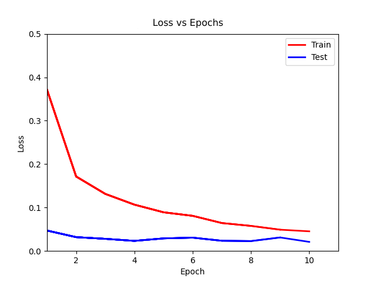
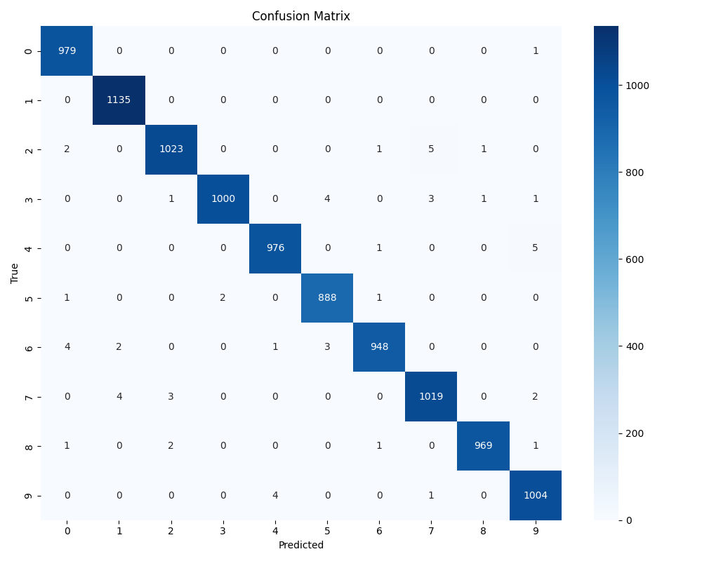

# Optimized CNN Classifier (MNIST)

## 1. Baseline Architecture & Design Choices

Based on the classifier developed on classes, we designed a Convolutional Neural Network (CNN), named `ModelBetterCNN`. 

### 1.1. Architectural Decisions

We employed a standard block structure: `Conv2d` $\rightarrow$ `BatchNorm2d` $\rightarrow$ `ReLU` $\rightarrow$ `MaxPool2d`.

- **Convolutional Depth:** The input image size ($28 \times 28$) dictated the network depth - the first block outputs $14 \times 14$, the second one $7 \times 7$ and the third one $3 \times 3$. A fourth block would reduce the spatial dimension to $1 \times 1$.

- **Filter Progression ($32 \to 64 \to 128$):** As the spatial resolution decreases via pooling, we effectively lose information. To compensate, we double the number of channels at each stage.

- **Regularization:** We incorporated Batch Normalization after convolutions to stabilize learning rates and Dropout before the fully connected layers to prevent overfitting.

- **Dropout Strategy ($p=0.5$):** We inserted a Dropout layer with a probability of $0.5$ before the fully connected classification head.

- **Loss Function:** On the `trainer.py`, we utilized `CrossEntropyLoss` instead of `MSELoss`. Since MSE (Mean Squared Errors) is designed for regression tasks and assumes a Gaussian distribution of errors, in classification, it suffers from the "vanishing gradient" problem when used with `SoftMax` outputs (the derivative is near zero when the prediction is completely wrong). `CrossEntropyLoss`  provides a convex error surface and penalizes incorrect confident predictions exponentially. This ensures steeper gradients and faster convergence for categorical probability distributions.

## 2. Ablation Studies & Architecture Search

Although the baseline model achieved excellent performance (99.30%), we conducted a series of experiments to isolate the influence of specific hyperparameters and architectural depth, so that we could understand the "why" behind the performance.

### Experiment A: The Impact of Batch Normalization
Removed all `nn.BatchNorm2d` layers.
* **Result:** 99.27% Accuracy.
* **Analysis:** While the accuracy remained high (probably due to the simplicity of the MNIST dataset), the training process revealed instability - specifically, the **Test Loss began to degrade after Epoch 7** ($0.025 \to 0.041$), while Train Loss continued to drop. This shows that, without Batch Normalization, the network tends to memorize noise/outliers in the training set, and that, while not strictly necessary for convergence on this dataset, Batch Normalization acts as a regulator for training stability over longer epochs.

### Experiment B: Dropout Analysis
We tested two extremes to understand the regularization effect:

1.  **No Dropout (`p=0.0`):**
    * **Result:** 99.10% Accuracy.
    * **Analysis:** The model exhibited overfitting behavior - the Test Loss increased significantly after Epoch 8 (from 0.020 to 0.035). Notably, the **Recall for digit '9' dropped from ~99% to 96.5%**, suggesting the network "memorized" common shapes but failed to generalize to variations.

2.  **High Dropout (`p=0.8`):**
    * **Result:** 99.41% Accuracy (best result).
    * **Analysis:** This model achieved the lowest Test Loss and it **was consistently lower than the Training Loss**. This occurs because the network trains with a lower capacity (neurons randomly silenced), but infers with its full capacity, which led to superior generalization and allowed us to verify that an aggressive dropout prevents the network from relying on single neurons for decision boundaries.

        We further experimented with an higher dropout rate of **$p=0.9$**, but accuracy dropped to **99.35%**. This suggests that silencing 90% of the neurons is excessive, crossing the threshold from beneficial regularization to destructive signal loss (approaching underfitting). 

### Experiment C: Depth

1.  **2 Blocks:**
    * **Result:** 99.08% Accuracy.
    * **Analysis:** Though we still achieved a high accuracy, by removing a convolutional block, the parameter count exploded from ~390k to ~3.2 Million. Stopping the pooling at $7 \times 7$ leaves a massive spatial tensor entering the Fully Connected layer ($64 \times 7 \times 7 = 3136$ inputs), showing that shallower CNNs can be computationally heavier due to the massive dense layer.

2.  **4 Blocks:**
    * **Result:** 99.24% Accuracy.
    * **Analysis:** Even though we added a new block, it reduced the feature map to **$1 \times 1$**. This caused the model to lost all relative spatial information - it can recognize features, but lacks its geometric configuration. The performance drop confirms that 3 blocks is the ideal depth for $28 \times 28$ inputs.

### Note on Performance
It is important to acknowledge that the quantitative variance between the tested architectures is marginal. This narrow range indicates a **"Ceiling Effect"**, typical of the MNIST dataset, where the signal-to-noise ratio is high enough that even sub-optimal architectures can achieve near-perfect convergence.

Therefore, the selection of the final model was not driven solely by the global accuracy metric, but primarily by qualitative behaviors, such as the **Training Stability** (the model with no Batch Normalization showed signs of divergence - rising test loss - whereas the final model remained stable) and the recovery of Recall for digit '9' (from 96.5% to 99.5%).

## 3. Final Model Analysis
Based on the experimental data, the model with **high droupout** (p=0.8) was selected as the final solution. Upon this architecture, we conducted a final evaluation.

### 3.1. Loss Graphic

  

The loss landscape shows us that the **Test Loss consistently remains below the Training Loss**. This "inverted" relationship confirms that the Dropout mechanism penalized the network during training, forcing the learning of redundant and robust features, while the stable trajectory of the test curve indicates a complete absence of overfitting despite the model's high capacity.

### 3.2. Confusion Matrix

  

The Confusion Matrix reveals that the remaining error margin (0.59%) is driven by specific morphological ambiguities rather than systemic failure, with the most frequent errors occurring between digits '4' and '9', and '2' and '7'. Notably, the model achieved **1.0000 Recall** for digit '1' and successfully resolved the generalization issue previously observed with digit '9', stabilizing its recall at **99.50%**, proving the effectiveness of the chosen architecture in handling complex handwritten topologies.

### 3.3. Statistical Metrics

|Epoch       |Precision|    Recall|  F1-score|   Support|
|------------|---------|----------|----------|----------|
|           0|   0.9919|    0.9990|    0.9954|       980|
|           1|   0.9947|    1.0000|    0.9974|      1135|
|           2|   0.9942|    0.9913|    0.9927|      1032|
|           3|   0.9980|    0.9901|    0.9940|      1010|
|           4|   0.9949|    0.9939|    0.9944|       982|
|           5|   0.9922|    0.9955|    0.9938|       892|
|           6|   0.9958|    0.9896|    0.9927|       958|
|           7|   0.9912|    0.9912|    0.9912|      1028|
|           8|   0.9979|    0.9949|    0.9964|       974|
|           9|   0.9901|    0.9950|    0.9926|      1009|
|    accuracy|         |          |    0.9941|     10000|
|   macro avg|   0.9941|    0.9940|    0.9941|     10000|
|weighted avg|   0.9941|    0.9941|    0.9941|     10000|

### Reproducibility Note

The quantitative results and visualizations presented in this report correspond to the optimal run obtained during the architecture exploration phase. 

Since neural network initialization and training dynamics are inherently stochastic, and a fixed random seed was not enforced during the initial search, marginal performance variations may occur across different executions. However, the **qualitative behavior** of the model, specifically the stability of the Loss curves, the resolution of overfitting and the superior generalization capability regarding digit '9', remains consistent across all runs.