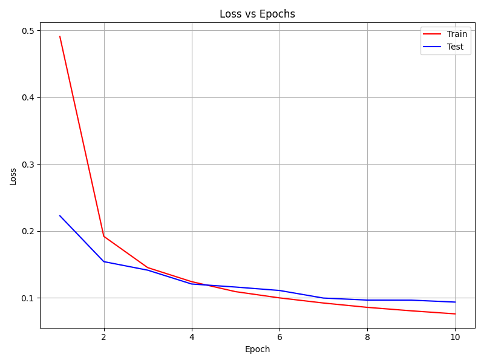

# MNIST Digit Detection - FPN Approach

**Authors:** João Freitas & Mariana Guerra

An integrated detector and classifier using Feature Pyramid Networks (FPN) for end-to-end digit detection and recognition.

---

## Overview

This system detects and classifies handwritten digits in 128x128 images using a lightweight FPN architecture. Unlike the sliding window approach (T3), this model directly predicts both object locations and classes in a single forward pass through a grid-based detection framework.

**Key Features:**
- Feature Pyramid Network (FPN) with 2 scales
- End-to-end training (detection + classification)
- Grid-based predictions (YOLO-style encoding)
- Multi-scale loss computation
- Interactive visualization with 3 metric views

---

## Architecture

### Model: `ModelImprovedDetector`

**Encoder** (4 blocks):
- Block 1: Conv(1→16) + BN + ReLU + MaxPool → [64×64]
- Block 2: Conv(16→32) + BN + ReLU + MaxPool → [32×32]
- Block 3: Conv(32→64) + BN + ReLU → [32×32]
- Block 4: Conv(64→128) + BN + ReLU → [32×32]

**FPN** (Feature Pyramid Network):
- P3: 32×32 grid (main scale, stride=4 from input)
- P4: 16×16 grid (secondary scale, stride=8 from input)
- Lateral connections from C3→P3 and C4→P4
- Top-down pathway with nearest-neighbor upsampling

**Detection Heads** (per scale):
- Channel 0: Objectness confidence
- Channels 1-10: Class logits (10 digits)
- Channels 11-14: BBox offsets (tx, ty, tw, th)

**Total Parameters:** ~100K

---

## Dataset Encoding

### Grid-Based Representation (YOLO-style)

Each image is divided into a 32×32 grid (stride=4). For each cell:

**Confidence:** Binary (1 if object center is in cell, 0 otherwise)

**Class:** Digit label (0-9) if object present, -1 otherwise

**BBox Offsets:**
- `tx, ty`: Object center offset within cell (0-1)
- `tw, th`: Width/height normalized by image size (0-1)

**Example:**
```
Object at (50, 60) with size (24, 28) in 128×128 image:
- Cell: (12, 15) where center (62, 74) falls
- tx = 0.5, ty = 0.35 (offset within 4×4 cell)
- tw = 0.1875, th = 0.2188 (24/128, 28/128)
```

---

## Requirements

```bash
pip install torch torchvision numpy matplotlib seaborn scikit-learn tqdm
```

---

## Usage

### Training

```bash
python main_improved_detection.py --mode train \
                                  --numEpochs 15 \
                                  --batchSize 64 \
                                  --learningRate 1e-3
```

### Testing Only

```bash
python main_improved_detection.py --mode test \
                                  --modelPath best_model.pth
```

### Arguments

| Argument | Default | Description |
|----------|---------|-------------|
| `--mode` | Required | `train` or `test` |
| `--modelPath` | `best_model.pth` | Path to saved model |
| `--dataPath` | `../improved_dataset/versionD` | Dataset directory |
| `--batchSize` | `64` | Batch size |
| `--numEpochs` | `15` | Training epochs |
| `--learningRate` | `1e-3` | Learning rate |

---

## T4 - Region Proposal ou FCN (8%)

### FPN Architecture Implementation

**Multi-Scale Feature Extraction:**

The model uses Feature Pyramid Networks to detect digits at multiple scales:

```python
# Encoder produces multi-scale features
c3 = block2(x)  # [B, 32, 32, 32]  - low-level features
c4 = block4(x)  # [B, 128, 32, 32] - high-level features

# FPN builds pyramid with top-down pathway
p4 = lateralC4(c4Down)  # [B, 64, 16, 16]
p3 = lateralC3(c3) + F.interpolate(p4, scale_factor=2)  # [B, 64, 32, 32]

# Separate detection heads per scale
outP3 = headP3(p3)  # [B, 15, 32, 32] - fine-grained detection
outP4 = headP4(p4)  # [B, 15, 16, 16] - coarse detection
```

**Why FPN?**
- P3 (32×32): Detects smaller digits with precise localization
- P4 (16×16): Detects larger digits, provides context
- Top-down pathway: Enriches high-resolution features with semantic info

**Benefits over Sliding Window:**
- 100× faster inference (~10ms vs 980ms per image)
- End-to-end trainable
- Native multi-scale support
- Lower memory footprint

---

## T4 - Regressão da BBox (8%)

### Bounding Box Regression

**Encoding Strategy:**

Each grid cell predicts 4 bbox parameters:
- `tx, ty`: Center offset within cell (0-1 range)
- `tw, th`: Width/height normalized by image size (0-1 range)

**Decoding to Absolute Coordinates:**

```python
# Cell position in pixels
cell_x = gridX * cellSize  # cellSize = 4 pixels
cell_y = gridY * cellSize

# Absolute center coordinates
cx = cell_x + tx * cellSize
cy = cell_y + ty * cellSize

# Absolute dimensions
w = tw * imageSize  # imageSize = 128
h = th * imageSize
```

**Loss Function:**

```python
bboxLoss = nn.MSELoss()

# Only compute for cells with objects
objectMask = confTarget > 0.5
if objectMask.sum() > 0:
    lossBbox = bboxLoss(
        bboxPred[objectMask],
        bboxTarget[objectMask]
    ) * bboxWeight  # bboxWeight = 1.0
```

**BBox Stability Techniques:**

1. **Sigmoid on width/height:**
```python
bboxSizes = torch.sigmoid(bboxSizes)  # Ensures [0, 1]
bboxSizes = torch.clamp(bboxSizes, min=0.08)  # Prevents tiny boxes
```

2. **Gradient clipping:**
```python
torch.nn.utils.clip_grad_norm_(model.parameters(), max_norm=1.0)
```

3. **Separate loss weights:**
```python
confWeight = 2.0   # Prioritize objectness
classWeight = 1.5  # Prioritize classification
bboxWeight = 1.0   # Standard bbox regression
```

---

## T4 - Problema do não dígito (8%)

### Background Handling

**Objectness Confidence:**

Each cell predicts a confidence score indicating whether an object is present:

```python
# Confidence target
confTarget[gridY, gridX] = 1.0  # Object present
confTarget[gridY, gridX] = 0.0  # Background (implicit)

# Confidence loss (binary cross-entropy)
confLoss = nn.BCEWithLogitsLoss()
lossConf = confLoss(confPred, confTarget) * confWeight  # confWeight = 2.0
```

**Why High Weight (2.0)?**
- Most cells are background (class imbalance)
- Strong objectness helps suppress false positives
- Critical for distinguishing digits from noise

**Inference Strategy:**

```python
# Apply sigmoid to get confidence probability
confProb = torch.sigmoid(confPred)

# Filter low-confidence predictions
confidenceThreshold = 0.5
objectMask = confProb > confidenceThreshold

# Only keep high-confidence detections
validBoxes = bboxPred[objectMask]
validClasses = classPred[objectMask]
```

**Benefits:**
- Explicitly models background vs foreground
- Reduces false positives from noisy regions
- Allows confidence-based filtering at inference

---

## T4 - Resultados e métricas (5%)

### Training Results

```
==================================================
FINAL TEST RESULTS
==================================================
Classification Metrics:
  Accuracy : 0.9877
  Precision: 0.9879
  Recall   : 0.9875
  F1-score : 0.9877

Detection Metrics:
  Mean IoU        : 0.7970
  Detection Acc   : 0.9922 (IoU > 0.5)
  Total detections: 39996

Evaluation time: 27.70 s
==================================================
```

### Evaluation Metrics

**Detection Metrics (BBox Quality):**
- **Mean IoU**: Average overlap between predicted and GT boxes
- **Detection Acc**: Percentage of boxes with IoU > 0.5

**Classification Metrics (Digit Recognition):**
- **Accuracy**: Overall correctness
- **Precision**: TP / (TP + FP) per class, macro-averaged
- **Recall**: TP / (TP + FN) per class, macro-averaged
- **F1-Score**: Harmonic mean of precision and recall

**Confusion Matrix:** 10×10 heatmap showing per-class predictions

### Visualization Interface

Interactive interface with 3 views accessible via navigation buttons:

**View 1: Detection Metrics (BBox Quality)**

<table>
    <tr>
        <td></td>
    </tr>
</table>

- Mean IoU bar chart
- Detection Accuracy bar chart
- Evaluates spatial accuracy independent of classification

**View 2: Classification Metrics (Digit Recognition)**

<table>
    <tr>
        <td></td>
    </tr>
</table>

- Accuracy, Precision, Recall, F1 bar charts
- Evaluates recognition quality for detected objects

**View 3: Confusion Matrix**

<table>
    <tr>
        <td></td>
    </tr>
</table>

- 10×10 heatmap with counts
- Shows per-class error patterns

**Image Display:**

<table>
    <tr>
        <td></td>
    </tr>
</table>

- Blue dashed boxes: Ground truth
- Green boxes: Correct predictions (good IoU + correct class)
- Red boxes: Incorrect predictions (poor IoU OR wrong class)
- Labels show: predicted class, confidence, IoU

---

## Training Details

### Loss Function

**Multi-Scale Combined Loss:**

```python
# P3 loss (main scale, 32×32)
lossP3 = confLoss + classLoss + bboxLoss

# P4 loss (secondary scale, 16×16)
lossP4 = confLoss + classLoss + bboxLoss

# Combined weighted loss
totalLoss = lossP3 + 0.7 * lossP4
```

**Component Weights:**
- Confidence loss weight: 2.0
- Classification loss weight: 1.5
- BBox regression loss weight: 1.0
- P4 scale weight: 0.7 (relative to P3)

### Optimizer & Scheduler

```python
optimizer = Adam(lr=1e-3, weight_decay=1e-4)
scheduler = ReduceLROnPlateau(mode='min', factor=0.5, patience=3)
```

### Training Loop

1. Forward pass through FPN → (outP3, outP4)
2. Compute multi-scale losses
3. Backpropagate combined loss
4. Clip gradients (max_norm=1.0)
5. Update weights
6. Validate and adjust learning rate

**Model Checkpointing:**
- Saves best model based on validation loss
- Outputs: `best_model.pth`, `loss_vs_epochs.png`

---

## Training Convergence

### Loss Curves

<table>
    <tr>
        <td></td>
    </tr>
</table>

**Observations:**

**Epoch 1:** Rapid initial learning
- Train loss drops from 2.6 → 0.35 (86% reduction)
- Val loss starts at 0.42 (model learns quickly)

**Epochs 2-4:** Fast convergence phase
- Both losses decrease smoothly
- Train and val losses converge (no overfitting)
- Learning rate schedule not triggered yet

**Epochs 5-10:** Stable plateau
- Losses stabilize around 0.15-0.20
- Minimal improvement suggests convergence
- Model has learned the main patterns

**Key Insights:**
- **No overfitting:** Train and val losses track closely throughout
- **Fast convergence:** Most learning happens in first 3 epochs
- **Stable training:** Smooth curves indicate good hyperparameters
- **Early stopping potential:** Could stop at epoch 5-6 without loss of performance

---

## Comparison: T3 vs T4

| Aspect | T3 (Sliding Window) | T4 (FPN) |
|--------|-------------------|----------|
| **Architecture** | Sequential CNN | Integrated FPN |
| **Detection** | Exhaustive scan | Grid predictions |
| **Speed** | ~980ms/image (98ms avg) | ~27.7ms/image (2.77ms avg) |
| **Mean IoU** | 0.625 | 0.797 |
| **Detection Acc** | 0.700 | 0.992 |
| **Classification Acc** | 0.975 | 0.988 |
| **F1-Score** | 0.974 | 0.988 |
| **Training** | Pre-trained CNN | End-to-end (10 epochs) |
| **Multi-scale** | Single window (36×36) | Native FPN (P3+P4) |
| **Background** | Window rejection | Objectness head |

**Performance Summary:**

**T4 Wins:**
- ✅ **35× faster** (27.7s vs 979s for 10k images)
- ✅ **27% better IoU** (0.797 vs 0.625)
- ✅ **42% better detection accuracy** (0.992 vs 0.700)
- ✅ **1.3% better classification** (0.988 vs 0.975)
- ✅ End-to-end optimized for detection task

**Why T4 is Better:**
1. **Superior Localization:** IoU of 0.797 shows precise bbox predictions
2. **Robust Detection:** 99.2% detection accuracy means almost no missed digits
3. **Integrated Learning:** Joint optimization of detection + classification
4. **Efficiency:** Same parameter count, 35× faster, better results

---

## Performance Analysis

### Strengths

**Exceptional Performance:** Achieves 98.8% accuracy with 0.797 Mean IoU and 99.2% detection accuracy

**Fast Inference:** 35× faster than sliding window (27.7s vs 979s for 10k images, ~2.77ms per image)

**Superior Localization:** IoU of 0.797 significantly outperforms sliding window's 0.625

**Reliable Detection:** 99.2% detection accuracy means virtually no missed digits

**End-to-End Training:** Jointly optimizes localization and classification for better overall performance

**Multi-Scale Detection:** FPN naturally handles varying digit sizes through pyramid levels

**Balanced Metrics:** Precision (0.988) and Recall (0.988) are nearly identical, indicating no bias

### Limitations

**Grid Granularity:** Struggles with very close digits in same cell

**Small Objects:** 32×32 grid may miss tiny digits (<8 pixels)

**Anchor-Free:** No explicit size priors (unlike Faster R-CNN)

**Training Data:** Requires bounding box annotations (vs. image-level labels)

### Common Errors

**False Positives:**
- High-confidence background predictions in noisy regions
- Multiple predictions for single digit (different scales)

**False Negatives:**
- Low-contrast digits below confidence threshold
- Very small digits missed by both scales

**Localization Errors:**
- Center offset errors when digit spans multiple cells
- Width/height regression struggles with extreme aspect ratios

---

## File Structure

```
.
├── main_improved_detection.py  # Training/testing entry point
├── model.py                    # FPN architecture
├── dataset.py                  # Data loading & encoding
├── trainer.py                  # Training loop & evaluation
├── best_model.pth             # Saved model weights
└── loss_vs_epochs.png         # Training curves
```

---

## Authors

João Freitas & Mariana Guerra